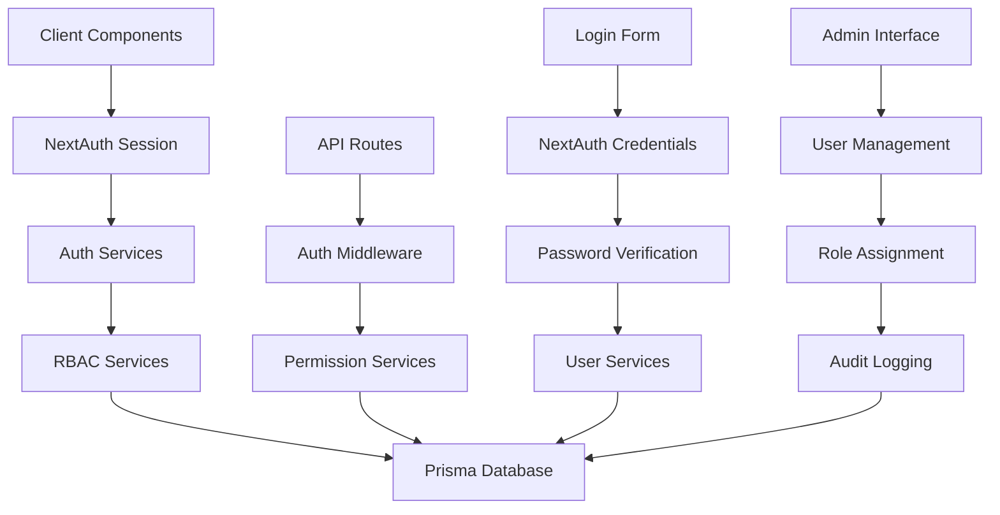
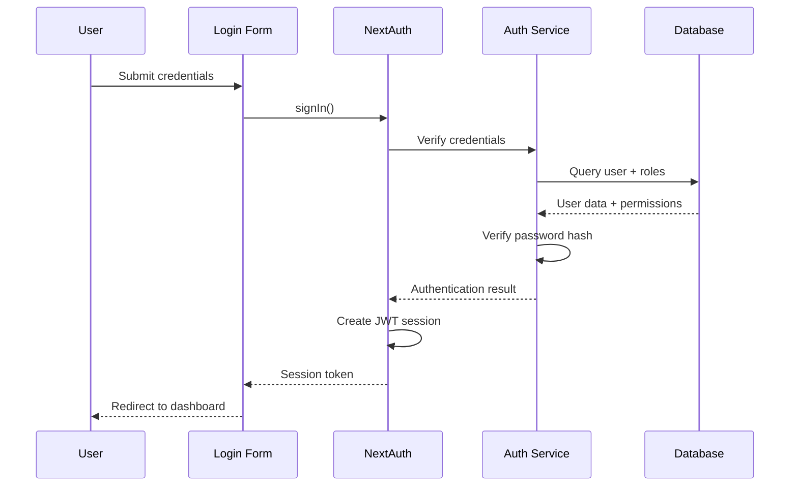

# Design Document

## Overview

This design document outlines the architecture for migrating from Clerk authentication to a custom NextAuth.js v5 + RBAC system. The solution provides complete authentication control, implements granular role-based permissions, and ensures data sovereignty for sensitive penetration testing data. The design leverages existing project infrastructure while introducing minimal breaking changes to maintain user experience continuity.

The architecture follows the project's progressive enhancement philosophy, building upon existing patterns and gradually replacing Clerk components with NextAuth.js equivalents while preserving all current functionality.

## Steering Document Alignment

### Technical Standards (tech.md)

The design strictly follows documented technical patterns:

- **NextAuth.js v5**: Aligned with planned migration from Clerk as specified in tech.md line 20-24
- **TypeScript**: Maintains strict type safety with comprehensive interface definitions
- **bcryptjs**: Uses existing password hashing utility from src/lib/auth/password.ts
- **Prisma ORM**: Leverages complete RBAC database schema already implemented
- **JSend API Format**: Maintains consistent response structure across all endpoints
- **React Hook Form + Zod**: Follows existing validation patterns for form handling

### Project Structure (structure.md)

Implementation follows established file organization conventions:

- **Feature-based structure**: Authentication components in src/features/auth/
- **Shared services**: Core auth logic in src/lib/auth/ and src/lib/services/
- **API routes**: Backend controllers in src/app/api/auth/
- **Component patterns**: Reusable UI components in src/components/ui/
- **TypeScript types**: Shared interfaces in src/types/auth.ts

## Code Reuse Analysis

### Existing Components to Leverage

- **UI Components**: Extensive shadcn/ui component library (Button, Input, Form, Dialog, etc.)
  - src/components/ui/form.tsx - React Hook Form integration patterns
  - src/components/ui/button.tsx - Consistent button styling
  - src/components/ui/input.tsx - Form input components
  - src/components/ui/dialog.tsx - Modal dialogs for user management

- **Password Utilities**: Complete password management system at src/lib/auth/password.ts
  - hashPassword() and verifyPassword() functions
  - Password complexity validation
  - Secure password generation utilities

- **Database Infrastructure**: Full RBAC schema implemented in Prisma
  - User, Role, Permission models with proper relationships
  - UserRole and RolePermission junction tables
  - AuditLog model for comprehensive logging

- **Utility Functions**: Core helper functions
  - src/lib/utils.ts - cn() function for className merging
  - TypeScript configuration - Strict typing patterns

### Integration Points

- **Current Providers**: src/components/layout/providers.tsx
  - Replace ClerkProvider with NextAuth SessionProvider
  - Maintain theme integration and provider structure

- **User Navigation**: src/components/layout/user-nav.tsx
  - Replace Clerk useUser() with NextAuth useSession()
  - Maintain dropdown menu structure and styling

- **Middleware**: src/middleware.ts
  - Replace clerkMiddleware with NextAuth middleware
  - Preserve route protection patterns and configuration

- **Database Connection**: Existing Prisma client configuration
  - Leverage established database connection patterns
  - Extend with NextAuth.js Prisma adapter

## Architecture

The authentication system follows a layered architecture with clear separation of concerns:



### Authentication Flow



## Components and Interfaces

### Component 1: NextAuth Configuration

- **Purpose**: Core authentication configuration and providers
- **File**: src/lib/auth/auth.ts
- **Interfaces**: 
  - NextAuth configuration object
  - Credentials provider setup
  - JWT callback for role inclusion
  - Session callback for user data
- **Dependencies**: NextAuth.js v5, Prisma adapter, auth services
- **Reuses**: Existing password verification utilities, database models

### Component 2: Authentication Services

- **Purpose**: Business logic for user authentication and session management
- **File**: src/lib/services/auth.service.ts  
- **Interfaces**:
  ```typescript
  interface AuthService {
    validateCredentials(email: string, password: string): Promise<User | null>
    updateLastLogin(userId: number): Promise<void>
    logAuthEvent(event: AuthEvent): Promise<void>
  }
  ```
- **Dependencies**: Prisma client, password utilities, audit logging
- **Reuses**: Existing password.ts utilities, User model, AuditLog model

### Component 3: RBAC Permission Services

- **Purpose**: Role-based access control and permission verification
- **File**: src/lib/services/permission.service.ts
- **Interfaces**:
  ```typescript
  interface PermissionService {
    hasPermission(userId: number, permission: string): Promise<boolean>
    getUserPermissions(userId: number): Promise<string[]>
    hasRole(userId: number, role: string): Promise<boolean>
  }
  ```
- **Dependencies**: Prisma client, RBAC database models
- **Reuses**: User, Role, Permission models and relationships

### Component 4: User Management Services

- **Purpose**: Administrative functions for user lifecycle management
- **File**: src/lib/services/user.service.ts
- **Interfaces**:
  ```typescript
  interface UserService {
    createUser(userData: CreateUserDTO): Promise<UserDTO>
    updateUserRoles(userId: number, roleIds: number[]): Promise<void>
    deactivateUser(userId: number): Promise<void>
    resetPassword(userId: number): Promise<string>
  }
  ```
- **Dependencies**: Prisma client, password utilities, audit logging
- **Reuses**: User model, UserRole relationships, password generation

### Component 5: Login Form Component

- **Purpose**: Secure login interface with validation and error handling
- **File**: src/features/auth/components/login-form.tsx
- **Interfaces**: React component with form state and validation
- **Dependencies**: React Hook Form, Zod validation, NextAuth signIn
- **Reuses**: shadcn/ui form components, existing form patterns

### Component 6: User Management Interface

- **Purpose**: Administrative dashboard for user and role management
- **File**: src/app/dashboard/users/page.tsx
- **Interfaces**: Data table with user list, role assignment, actions
- **Dependencies**: TanStack Table, user services, permission checks
- **Reuses**: Existing table components, dialog components, button patterns

## Data Models

### Extended NextAuth Models

```typescript
// Extends existing Prisma User model
interface User {
  id: number
  email: string
  username: string
  passwordHash: string
  fullName?: string
  avatar?: string
  isActive: boolean
  lastLoginAt?: Date
  createdAt: Date
  updatedAt: Date
  
  // Relations
  userRoles: UserRole[]
  auditLogs: AuditLog[]
}

// NextAuth Session Extension (Hybrid Strategy)
interface Session {
  user: {
    id: number
    email: string
    username: string
    fullName?: string
    avatar?: string
    roles: string[]  // Store role names in JWT session
    // Permissions queried from database when needed for security
  }
  expires: string
}
```

### Authentication DTOs

```typescript
interface LoginCredentials {
  email: string
  password: string
}

interface CreateUserDTO {
  email: string
  username: string
  fullName?: string
  roleIds: number[]
}

interface UserDTO {
  id: number
  email: string
  username: string
  fullName?: string
  avatar?: string
  isActive: boolean
  roles: RoleDTO[]
  lastLoginAt?: Date
  createdAt: Date
}
```

## Error Handling

### Error Scenarios

1. **Authentication Failures**
   - **Handling**: Clear user feedback, rate limiting, audit logging
   - **User Impact**: Informative error messages, temporary lockout after 5 attempts

2. **Database Connection Failures**
   - **Handling**: Graceful degradation, fail-secure approach, retry logic
   - **User Impact**: "Service temporarily unavailable" message, maintains security

3. **Permission Denied**
   - **Handling**: Log unauthorized access attempts, clear error messaging
   - **User Impact**: "Access denied" message with contact information

4. **JWT Token Issues**
   - **Handling**: Force re-authentication, secure token validation
   - **User Impact**: Automatic redirect to login, session restoration

5. **Migration Failures**
   - **Handling**: Automatic rollback to Clerk, administrator notification
   - **User Impact**: Transparent fallback, no service disruption

## Testing Strategy

### Unit Testing

- **Authentication Services**: Mock database calls, test credential validation
- **Permission Services**: Test role-based access control logic
- **Password Utilities**: Verify hashing and validation functions
- **Form Components**: Test validation rules and error handling

### Integration Testing

- **Login Flow**: End-to-end authentication process
- **RBAC Integration**: Role assignment and permission checking
- **Database Operations**: User creation, role updates, audit logging
- **API Endpoints**: Authentication middleware and response formats

### End-to-End Testing

- **User Login Journey**: Complete authentication workflow
- **Admin User Management**: User creation, role assignment, deactivation
- **Session Management**: Concurrent sessions, logout, token expiration
- **Migration Process**: Clerk to NextAuth transition validation

### Security Testing

- **Brute Force Protection**: Rate limiting and account lockout
- **JWT Security**: Token tampering detection and expiration
- **Input Validation**: SQL injection and XSS prevention
- **Permission Bypass**: Unauthorized access attempt detection

## Migration Strategy

### Phase 1: NextAuth Setup
- Install NextAuth.js v5 and Prisma adapter
- Configure authentication providers and JWT settings
- Create authentication services and permission utilities

### Phase 2: Database Migration
- Execute Prisma migrations for RBAC schema
- Run seed data for initial roles and permissions
- Create admin user account with system privileges

### Phase 3: Component Migration
- Replace Clerk login form with NextAuth login component
- Update user navigation and session handling
- Implement permission-based component rendering

### Phase 4: Middleware Migration  
- Replace Clerk middleware with NextAuth protection
- Update route protection patterns
- Implement permission checking middleware

### Phase 5: User Management
- Create admin interface for user management
- Implement role assignment and user lifecycle features
- Add comprehensive audit logging

### Phase 6: Validation and Cleanup
- Comprehensive testing of all authentication flows
- Remove all Clerk dependencies and configurations
- Update documentation and deployment processes

## Security Considerations

- **Password Security**: bcryptjs with 12 salt rounds, complexity requirements
- **Session Management**: 24-hour JWT expiration, secure cookie configuration  
- **Rate Limiting**: 5 failed attempts triggers 30-minute lockout
- **Audit Trail**: Complete logging of authentication and authorization events
- **Input Validation**: Zod schemas for all user inputs and API requests
- **Database Security**: Parameterized queries, connection encryption
- **Error Handling**: Fail-secure approach, no sensitive data in error messages