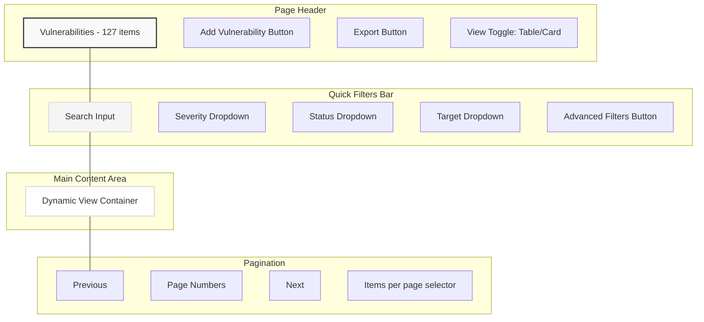
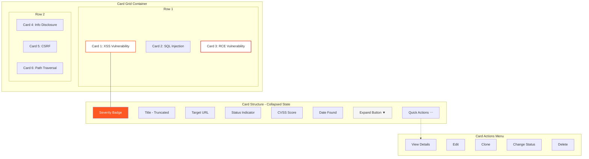
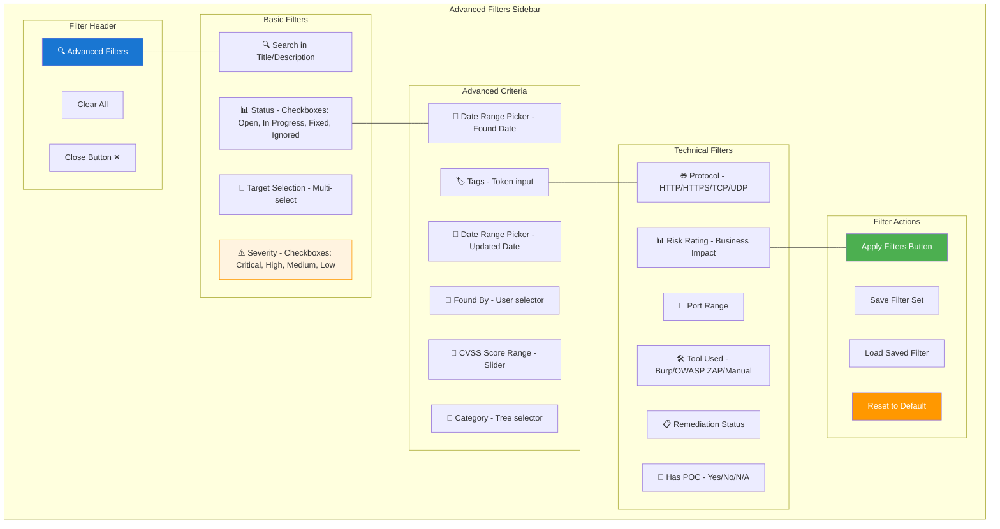
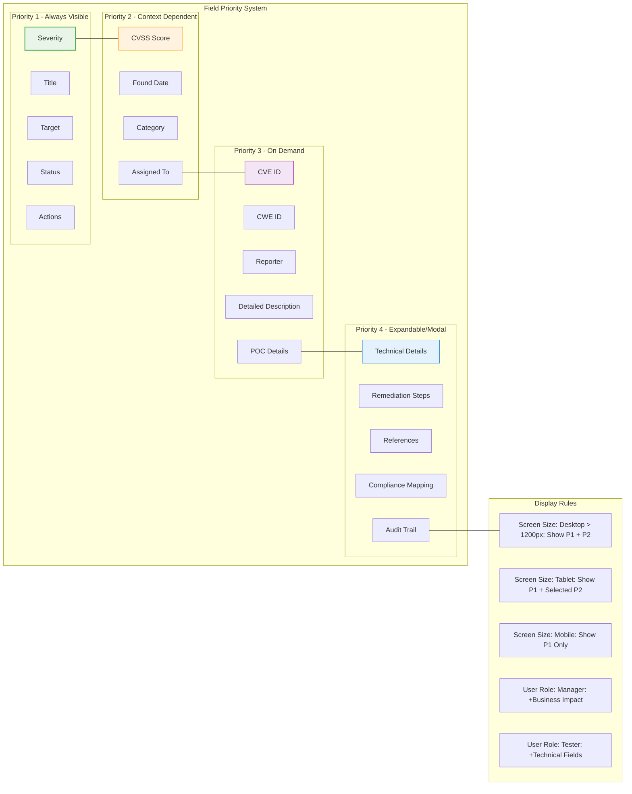
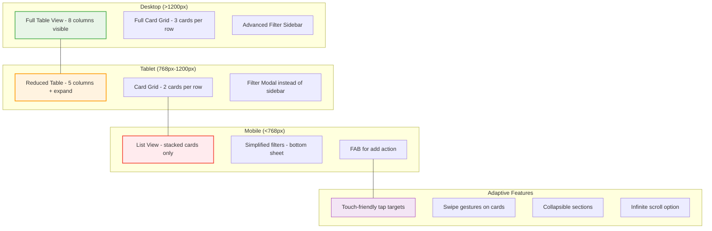

# Vulnerability Management List Page - Wireframes

## 1. Main Layout Overview



## 2. Table View Layout

```mermaid
graph TB
    subgraph "Table View Container"
        subgraph "Table Header"
            TH1[Select All ☐]
            TH2[Severity ↓]
            TH3[Title]
            TH4[Target]
            TH5[Status]
            TH6[CVSS Score]
            TH7[Found Date]
            TH8[Actions ⋯]
        end
        
        subgraph "Table Rows - Smart Display Strategy"
            TR1[☐ High XSS Vulnerability example.com Open 8.2 2024-01-15 ⋯]
            TR2[☐ Medium SQL Injection api.test.com Fixed 6.5 2024-01-14 ⋯]
            TR3[☐ Critical RCE vuln server.prod.com Open 9.8 2024-01-13 ⋯]
            TR4[☐ Low Info Disclosure blog.com Ignored 3.1 2024-01-12 ⋯]
            TR5[... (more rows)]
        end
        
        subgraph "Column Management"
            CM1[Visible: 8/32 columns]
            CM2[Customize Columns Button]
            CM3[Reset View Button]
        end
    end
    
    subgraph "Row Hover Actions"
        HA1[Quick Edit]
        HA2[View Details]
        HA3[Clone]
        HA4[Delete]
    end
    
    TH1 --- TR1
    TR1 -.-> HA1
    TR5 --- CM1
    
    style TH2 fill:#e3f2fd,stroke:#1976d2,stroke-width:2px
    style TR1 fill:#fff3e0,stroke:#f57c00,stroke-width:1px
    style TR3 fill:#ffebee,stroke:#d32f2f,stroke-width:1px
    style HA1 fill:#f1f8e9,stroke:#388e3c,stroke-width:1px
```

## 3. Card View Layout



## 4. Expanded Card State

```mermaid
graph TB
    subgraph "Expanded Card"
        subgraph "Card Header"
            ECH1[Critical Badge]
            ECH2[XSS Vulnerability in Login Form]
            ECH3[Collapse Button ▲]
        end
        
        subgraph "Card Body - Two Columns"
            subgraph "Left Column"
                ECL1[🎯 Target: example.com/login]
                ECL2[📅 Found: 2024-01-15]
                ECL3[👤 Found by: John Doe]
                ECL4[🔢 CVSS: 8.2 (High)]
                ECL5[📊 Status: Open]
                ECL6[📂 Category: Web Application]
            end
            
            subgraph "Right Column"
                ECR1[📝 Description Preview...]
                ECR2[🔗 References: OWASP-A07]
                ECR3[⚡ POC Available: Yes]
                ECR4[🛠️ Remediation: Input Validation]
                ECR5[📋 Tags: XSS, Login, Critical]
                ECR6[🔄 Last Updated: 2024-01-16]
            end
        end
        
        subgraph "Card Actions"
            ECA1[View Full Details]
            ECA2[Edit Vulnerability]
            ECA3[Export to PDF]
            ECA4[Add to Report]
        end
    end
    
    ECH1 --- ECL1
    ECL6 --- ECR1
    ECR6 --- ECA1
    
    style ECH1 fill:#d32f2f,color:#fff
    style ECH2 fill:#fff,stroke:#d32f2f,stroke-width:2px
    style ECA1 fill:#1976d2,color:#fff
    style ECA2 fill:#388e3c,color:#fff
```

## 5. Advanced Filter Panel (Sidebar)



## 6. Column Customization Modal

```mermaid
graph TB
    subgraph "Column Customization Modal"
        subgraph "Modal Header"
            MH1[⚙️ Customize Table Columns]
            MH2[Close Button ✕]
        end
        
        subgraph "Available Columns - Left Panel"
            AC1[📋 Available (24 columns)]
            AC2[☐ CVE ID]
            AC3[☐ CWE ID]
            AC4[☐ Reporter Email]
            AC5[☐ Affected Component]
            AC6[☐ Exploit Complexity]
            AC7[☐ Business Impact]
            AC8[... (18 more)]
        end
        
        subgraph "Selected Columns - Right Panel"
            SC1[✓ Selected (8 columns)]
            SC2[☑ Severity - Drag handle ≡]
            SC3[☑ Title - Drag handle ≡]
            SC4[☑ Target - Drag handle ≡]
            SC5[☑ Status - Drag handle ≡]
            SC6[☑ CVSS Score - Drag handle ≡]
            SC7[☑ Found Date - Drag handle ≡]
            SC8[☑ Actions - Drag handle ≡]
        end
        
        subgraph "Column Presets"
            CP1[📋 Quick Presets:]
            CP2[Executive Summary - 5 cols]
            CP3[Technical Details - 12 cols]
            CP4[Compliance Report - 8 cols]
            CP5[Assessment View - 15 cols]
        end
        
        subgraph "Modal Actions"
            MA1[Apply Changes]
            MA2[Reset to Default]
            MA3[Cancel]
        end
    end
    
    MH1 --- AC1
    AC8 --- SC1
    SC8 --- CP1
    CP5 --- MA1
    
    style MH1 fill:#1976d2,color:#fff
    style SC2 fill:#e8f5e8,stroke:#4caf50,stroke-width:1px
    style SC3 fill:#e8f5e8,stroke:#4caf50,stroke-width:1px
    style MA1 fill:#4caf50,color:#fff
    style CP2 fill:#f3e5f5,stroke:#9c27b0,stroke-width:1px
```

## 7. Smart Display Strategy for 30+ Fields



## 8. Responsive Behavior



## Design Notes

### Table View Strategy
- **Primary columns**: Always visible (Severity, Title, Target, Status, Actions)
- **Secondary columns**: Context-dependent (CVSS, Date, Category)
- **Column customization**: Full control over visible columns
- **Smart sorting**: Most critical vulnerabilities first
- **Inline editing**: Quick status updates without navigation

### Card View Benefits  
- **Information density**: More fields visible per item
- **Visual hierarchy**: Color-coded severity badges
- **Progressive disclosure**: Expand for full details
- **Touch-friendly**: Better for tablets and mobile
- **Contextual actions**: Hover/touch reveals options

### Filter Philosophy
- **Quick filters**: Common use cases in header bar
- **Advanced filters**: Comprehensive options in sidebar
- **Filter persistence**: Remember user preferences
- **Filter sharing**: Save and share filter combinations
- **Smart defaults**: Role-based default filters

### Performance Considerations
- **Virtualization**: Handle large datasets efficiently
- **Lazy loading**: Load additional details on demand
- **Caching**: Cache filter results and user preferences
- **Debounced search**: Reduce API calls during typing
- **Pagination**: Manageable chunks with smooth navigation